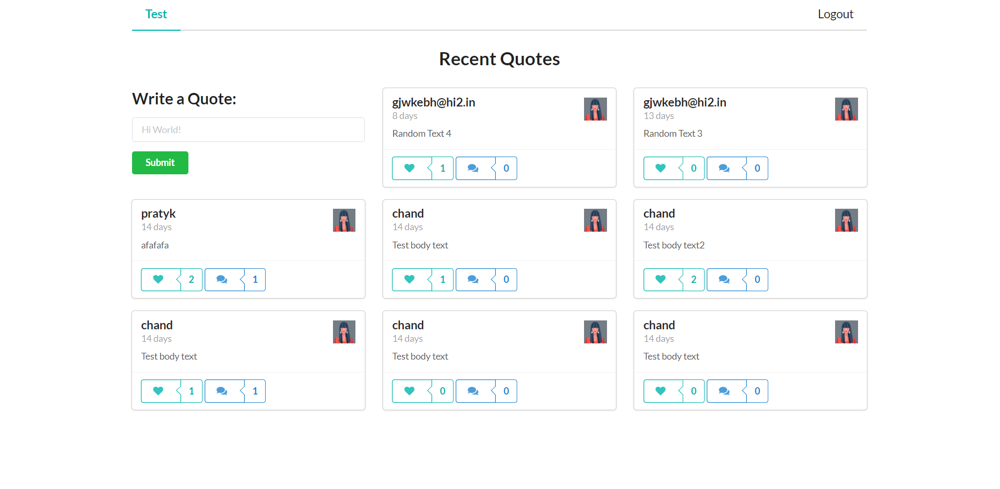

# Social Media App (Quotes Sharing)

## [Check out the live version ](https://quote-social-media-webapp.netlify.app/)

## Use username gjwkebh@hi2.in, pass - 12345678 to login or create your own user

## Features

- Login & Register pages
- Semantic UI & Routes
- Displaying, Adding & Deleting posts
- Displaying, Adding & Deleting Comments
- Like Button
- Single post page
- Info Popups

## Description

Here is a social media app made using MongoDB, Express, Node, React, GraphQL, and Node (the MERNG stack).
It implements a GraphQL server that uses Node and Express to communicate to a MongoDB Database and fetch and persist data to a social media app back-end.

## Tech

- React
- MongoDB
- Apollo Server
- GraphQL
- node.js - evented I/O for the backend
- Express - fast node.js network app framework
